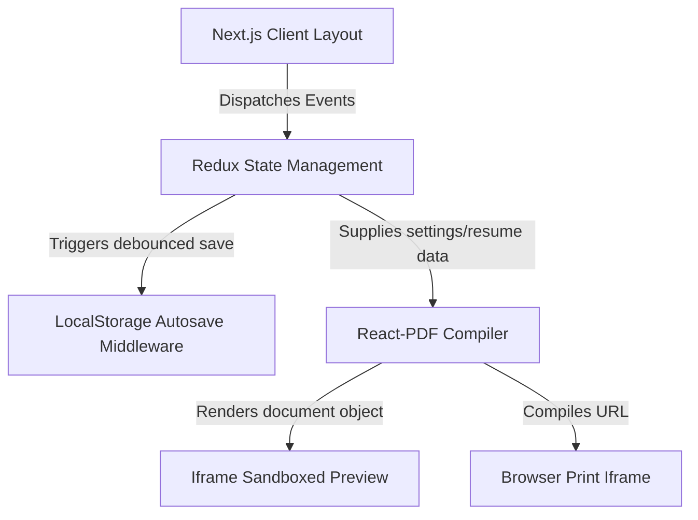

# System Architecture Documentation

This document describes the high-level architecture, state flow, and data flow of ResumeFlow.

## Component Overview

## Layers

### 1. Presentation Layer (Next.js & React)

- **Editor Panel**: Structured dynamic input card modules (Profile, Experience, Education, Projects).
- **Preview Canvas**: Uses standard sandboxed iframes to display compiled pdf styles instantly.
- **Control Panel**: Exposes scale range sliders, printer bindings, and download buttons.

### 2. State & Storage Layer (Redux Toolkit)

- **resumeSlice**: Records name details, bullet points lists, and project profiles.
- **settingsSlice**: Records active font choices, custom color theme values, sizing types, and layout ordering indices.
- **Autosave Middleware**: Listens to slice updates and writes JSON blocks to localStorage after a debounced wait period of 1000ms.

### 3. Rendering Layer (React-PDF)

- **styles.ts**: Translates Tailwind layout sizes from CSS units to React-PDF point units (`pt`).
- **ResumePDF**: Translates selected template values to choose specific fonts, borders, and margins before compilation.
