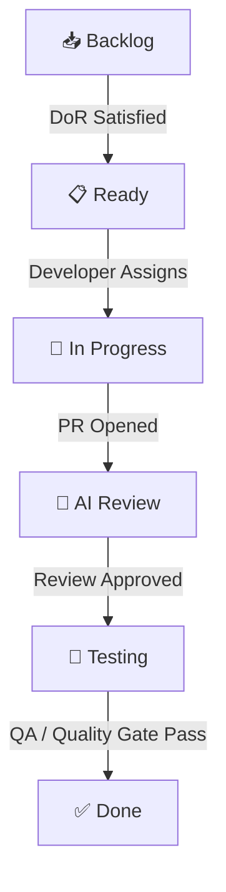

# Kanban Board Specification & Workflow Rules

This document defines the columns, policies, and transition rules for the ResumeFlow Kanban Board.

---

## 1. Column Definitions

### 📥 Backlog
*   **Purpose**: The central inbox for all potential work.
*   **Content**: Feature ideas, future roadmap epics, technical debt proposals, and research spikes.
*   **Owner**: Product Owner / Lead Engineer.

### 📋 Ready
*   **Purpose**: A pipeline of fully defined tasks ready for sprint planning and implementation.
*   **Content**: Groomed issues that satisfy the **Definition of Ready (DoR)**.
*   **Owner**: Engineering Team.

### 🚀 In Progress
*   **Purpose**: Active execution.
*   **Policy**:
    *   An engineer (or AI developer) may only have **one** issue in this column active at a time to prevent context switching.
    *   Must be assigned to the current Sprint Milestone.
*   **Owner**: Assigned Developer.

### 👀 AI Review
*   **Purpose**: Code quality, architectural integrity, and security validation before merging.
*   **Policy**:
    *   Triggers when a Pull Request is opened against the `develop` branch.
    *   Runs the multi-stage quality review: Architecture Review, Code Quality review, Performance audit, Accessibility check, and Security audit.
*   **Owner**: Peer Reviewers / AI Quality Agent.

### 🧪 Testing
*   **Purpose**: Post-merge verification on the staging/integration build.
*   **Policy**:
    *   Code compiles without warnings and all unit/integration tests pass.
    *   Includes manual verification, functional checks, and regression sweeps.
*   **Owner**: QA Lead / Validation Agent.

### ✅ Done
*   **Purpose**: Fully completed and delivered increments.
*   **Policy**:
    *   Code is merged into `develop` / `main`.
    *   Verified on staging.
    *   Release tag generated.
*   **Owner**: Product Owner.

---

## 2. Transition Policies (WIP Limits & Gates)

| Transition | From | To | Gates & Requirements |
| :--- | :--- | :--- | :--- |
| **Grooming** | Backlog | Ready | Satisfies the **Definition of Ready (DoR)**. Needs acceptance criteria. |
| **Pulling** | Ready | In Progress | Developer assigns themselves to the issue, moves to current milestone. |
| **Completing** | In Progress | AI Review | Pull Request is opened. Unit tests pass locally. |
| **Merging** | AI Review | Testing | PR approved by reviewers. Code merged into integration branch. |
| **Releasing** | Testing | Done | Verified in build test. Closes associated GitHub Issue. |
